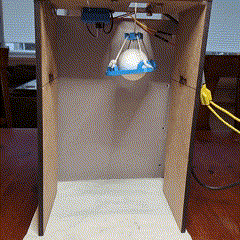
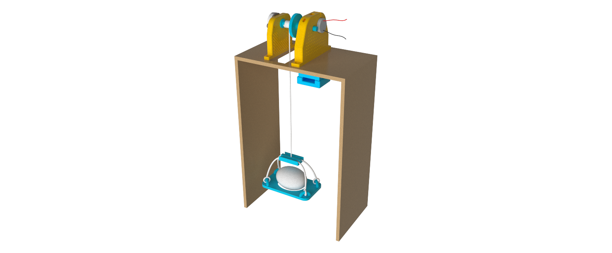

# Test rig for implementation of system identification and optimal state estimation

The repository contains the files used to design a test rig for the course AIS2202 - Cybernetics at NTNU in Ålesund. The course is divided in three modules where two of the three modules is carried out using a test rig.

## System identification

The first assignment was to drop an egg from a height of 20 cm towards the ground in the fastest way possible without breaking the egg. The group then had to do *system identification* in order to estimate the system parameters.

  

## Optimal State Estimation

The second assignment was to use *optimal state estimation* in order to estimate the height above ground. A Kalman filter was used for sensor fusion.

Test video - System identification          |  Test video - Optimal State Estimation         
:-------------------------:|:-------------------------:
 | 

## Physical design

[3D printed parts](docs/parts/Printed%20parts/) \
[Laser cut parts](docs/parts/Laser%20cut%20parts/)

### System identification test rig assembly
[3MF](System_identification/test_rig_si.3mf) \
[CADs](System_identification/CAD/)

### Optimal state estimation test rig assembly
[3MF](Optimal_state/test_rig_ope.3mf) \
[CADs](Optimal_state/CAD/)

## Getting Started

### Dependencies
#### Python libraries

* [Numpy](https://numpy.org/)
* [Socket](https://docs.python.org/3/library/socket.html)
* [Time](https://docs.python.org/3/library/time.html?highlight=time#module-time)

#### Arduino libraries
* [HardWire](https://github.com/thexeno/HardWire-Arduino-Library)
* [VL53L0X](https://github.com/pololu/vl53l0x-arduino)
* [I2C MPU6886](https://github.com/tanakamasayuki/I2C_MPU6886)
* [Ethernet](https://www.arduino.cc/reference/en/libraries/ethernet/)
* [AVR Standard C Time](https://www.arduino.cc/reference/en/libraries/avr-standard-c-time-library/)

### Software

* [Arduino](https://www.arduino.cc/)

* [Python](https://www.python.org/)

* [MATLAB](https://se.mathworks.com/products/matlab.html)

## Authors

* **Karl Johan Alvestad** - [kongapls](https://github.com/kongapls)

* **Joakim Sander Løken** - [siamigo](https://github.com/siamigo)

* **Jørgen Rottem** - [Jorgen14](https://github.com/Jorgen14)
