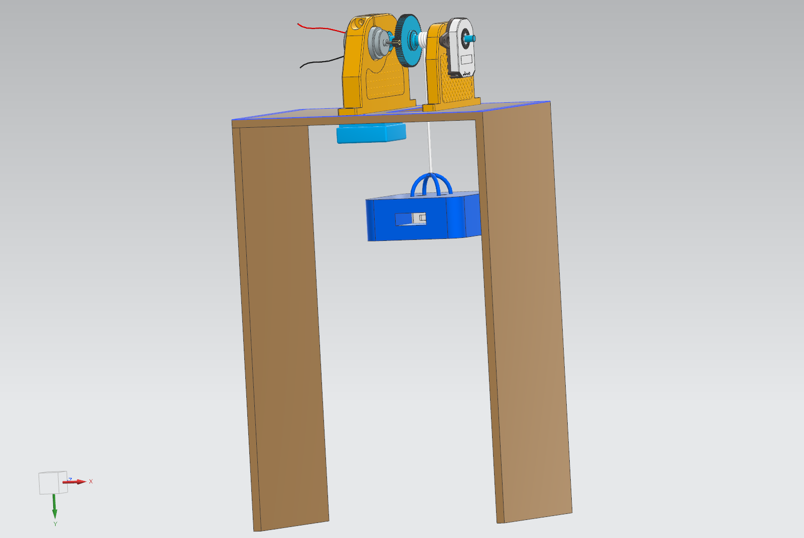

# Test rig for implementation of system idenetification and optimal state estimation
This is a repository for introducing our work at NTNU Ålesund in AIS2202 - Cybernetics

## System identification
Test rig design           |  Video of result                
:-------------------------:|:-------------------------:
  | 

## Optimal State Estimation
Test rig design          |  Video of result         
:-------------------------:|:-------------------------:
  | 

## 3D-model files
### System identification
[3MF](System_identification/test_rig_si.3mf) \
[CADs](System_identification/CAD/)

### Optimal state estimation
[3MF](Optimal_state/test_rig_ope.3mf) \
[CADs](Optimal_state/CAD/)

## Dependencies

### Python

### Arduino

## Software

* [Arduino](https://www.arduino.cc/) - Arduino

* [Python](https://www.python.org/) - Python

## Authors

* **Karl Johan Alvestad** - [kongapls](https://github.com/kongapls)

* **Joakim Sander Løken** - [siamigo](https://github.com/siamigo)

* **Jørgen Rottem** - [Jorgen14](https://github.com/Jorgen14)
