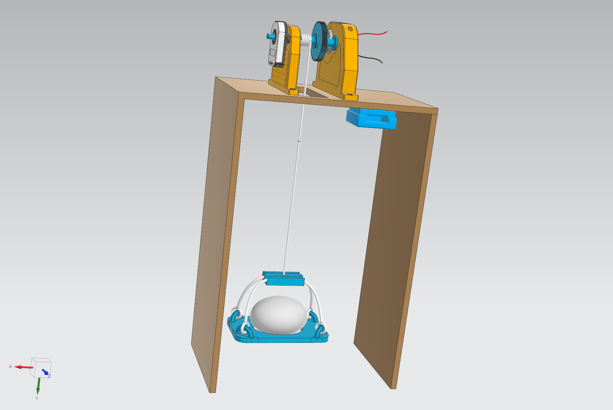
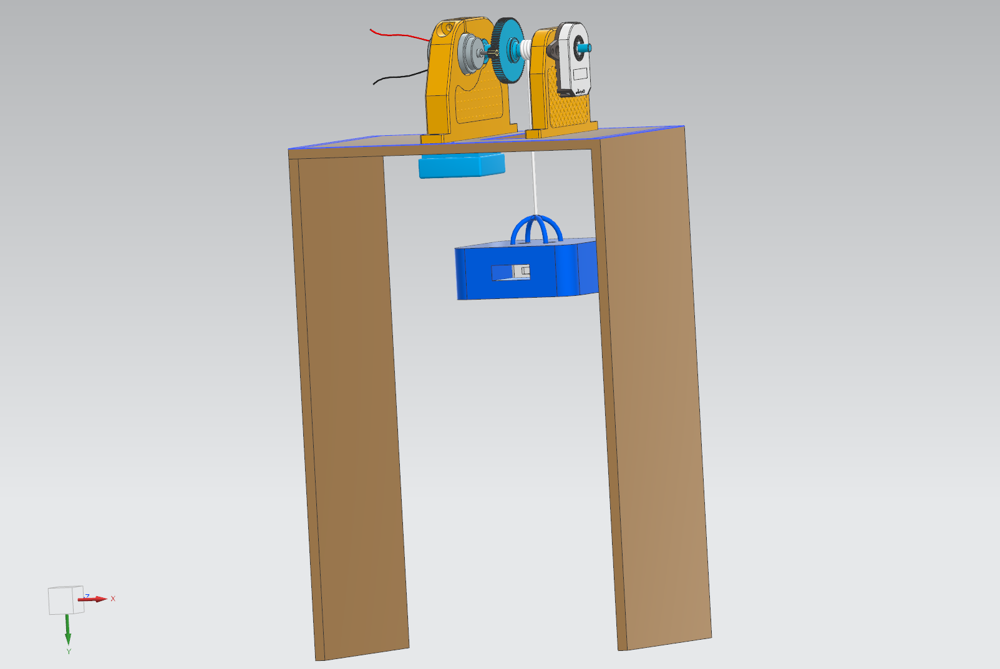

# Test rig for implementation of system idenetification and optimal state estimation
This is a repository for introducing our work at NTNU Ålesund in AIS2202 - Cybernetics

## System identification
Test rig design           |  Video of result                
:-------------------------:|:-------------------------:
  | 

## Optimal State Estimation
Test rig design          |  Video of result         
:-------------------------:|:-------------------------:
  | 

## 3D-model files
### System identification
[3MF](System_identification/test_rig_si.3mf) \
[CADs](System_identification/CAD/)

### Optimal state estimation
[3MF](Optimal_state/test_rig_ope.3mf) \
[CADs](Optimal_state/CAD/)

## Getting Started

### Dependencies
#### Python libraries

* [Numpy](https://numpy.org/)
* [Socket](https://docs.python.org/3/library/socket.html)
* [Time](https://docs.python.org/3/library/time.html?highlight=time#module-time)

#### Arduino libraries
* [HardWire](https://github.com/thexeno/HardWire-Arduino-Library)
* [VL53L0X](https://github.com/pololu/vl53l0x-arduino)
* [I2C MPU6886](https://github.com/tanakamasayuki/I2C_MPU6886)
* [Ethernet](https://www.arduino.cc/reference/en/libraries/ethernet/)
* [AVR Standard C Time](https://www.arduino.cc/reference/en/libraries/avr-standard-c-time-library/)

### Software

* [Arduino](https://www.arduino.cc/)

* [Python](https://www.python.org/)

## Authors

* **Karl Johan Alvestad** - [kongapls](https://github.com/kongapls)

* **Joakim Sander Løken** - [siamigo](https://github.com/siamigo)

* **Jørgen Rottem** - [Jorgen14](https://github.com/Jorgen14)
